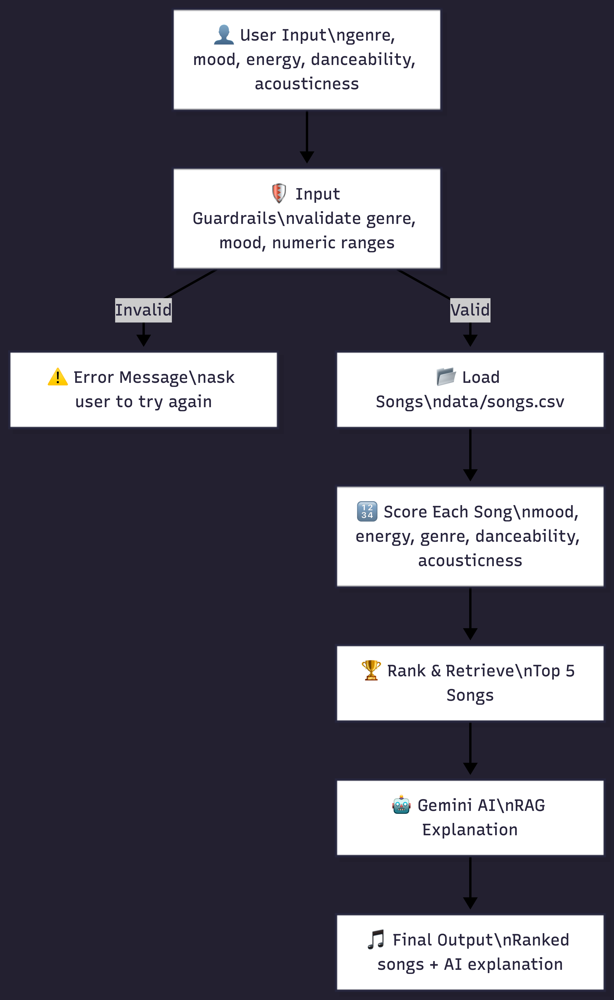

# 🎵 Music Recommender Simulation

## Original Project
This project extends the **Music Recommender Simulation** from Module 3. My original system loaded a catalog of songs from a CSV file and scored each one out of 100 points based on how well it matched a user's taste profile across five features: genre, mood, energy, danceability, and acousticness. It was a rule-based scoring system with no AI integration — purely logic and math.

## Title
AI-Powered Music Recommender 

## Summary
This project upgrades the original rule-based recommender into a real AI-powered system. It keeps the original scoring logic to retrieve the best matching songs from the catalog, then passes those results to Google Gemini which generates a friendly, personalized explanation of why those songs fit the user's vibe. It also includes input guardrails that catch and handle invalid user input gracefully instead of crashing.

This matters because it demonstrates a real-world AI pattern called Retrieval-Augmented Generation (RAG), where an AI model is grounded in actual retrieved data rather than generating answers from scratch — making the output more accurate and trustworthy.

## Architecture Overview

The system works in four stages:

**1. Input & Validation**
The user enters their music preferences — genre, mood, energy, danceability, and acousticness. Guardrails check that genre and mood are valid options and that numeric values are between 0.0 and 1.0. Invalid input loops back and asks the user to try again instead of crashing.

**2. Retrieval**
The scoring engine loads songs from `data/songs.csv` and scores each one based on how closely it matches the user's preferences. Each feature contributes a certain number of points toward a total score out of 100.

**3. Generation**
The top 5 retrieved songs are sent to Google Gemini along with the user's taste profile. Gemini generates a 3-4 sentence explanation in a friendly, conversational tone explaining why those songs are a good match.

**4. Output**
The ranked songs and Gemini explanation are printed to the terminal for the user to read.

## Setup Instructions

### 1. Clone the repo

git clone https://github.com/Kelvon23/applied-ai-system-project.git
cd applied-ai-system-project

### 2. Install dependencies

pip install -r requirements.txt

This installs all required libraries including `google-genai`, `python-dotenv`, `pandas`, and `pytest`.

### 3. Get a free Gemini API key
- Go to [aistudio.google.com](https://aistudio.google.com)
- Sign in with your Google account
- Click **Get API Key** → **Create project** → copy your key

### 4. Create a `.env` file
In the root of the project create a file called `.env` and add:

GEMINI_API_KEY=your_actual_key_here

### 5. Run the app

python -m src.main

### 6. Run the tests

pytest

## Sample Interactions

### Example 1 — Happy Pop Fan
**Input:**

Genre: pop
Mood: happy
Target energy: 0.5
Target danceability: 0.7
Target acousticness: 0.5

**Output:**

#1 Sunrise City by Neon Echo
Genre: pop | Mood: happy | Score: 57.45 / 100
Why: energy closeness (+17.0), genre match (+20), danceability closeness (+13.65), acousticness closeness (+6.8)
#2 Gym Hero by Max Pulse
Genre: pop | Mood: intense | Score: 52.05 / 100
Why: energy closeness (+14.25), genre match (+20), danceability closeness (+12.3), acousticness closeness (+5.5)
🤖 Gemini: We've curated a playlist just for you, full of happy pop vibes!
Our top picks like Sunrise City and Gym Hero are a perfect match for your
pop genre preference, hitting your desired energy, danceability, and acoustic levels.

### Example 2 — Chill Lofi Listener
**Input:**

Genre: lofi
Mood: chill
Target energy: 0.2
Target danceability: 0.3
Target acousticness: 0.8

**Output:**

#1 Library Rain by Paper Lanterns
Genre: lofi | Mood: chill | Score: 63.20 / 100
Why: energy closeness (+23.75), genre match (+20), danceability closeness (+10.8), acousticness closeness (+8.6)
#2 Midnight Coding by LoRoom
Genre: lofi | Mood: chill | Score: 61.30 / 100
Why: energy closeness (+23.0), genre match (+20), danceability closeness (+9.3), acousticness closeness (+7.9)
🤖 Gemini: These picks are perfect for a chill lofi session! Library Rain
and Midnight Coding both nail your low energy and high acousticness targets,
making them ideal background tracks for studying or winding down.

## Design Decisions

**Why RAG instead of asking Gemini to recommend directly?**
Letting Gemini recommend songs from scratch would produce hallucinated song titles that don't exist in the catalog. By retrieving real songs first with the scoring engine and then passing them to Gemini, the AI explanation is always grounded in actual data. This is the core idea behind RAG and it makes the output much more accurate and trustworthy.

**Why input guardrails with loops instead of just crashing?**
A real application should never crash because a user made a typo. The guardrail loops keep asking until valid input is provided rather than ending the program with an error. This makes the system feel polished and production-ready instead of fragile.

**Why Google Gemini?**
Gemini's API is free to access via Google AI Studio with no credit card required, making it practical for a student project. The `google-genai` library is simple, well documented, and actively maintained.

**Why keep the original scoring logic?**
The original point-based scoring system is transparent and explainable — you can see exactly why a song ranked where it did. Replacing it with a pure AI approach would make the system a black box. Keeping the scorer as the retrieval layer and using Gemini only for explanation gives the best of both worlds: accuracy and interpretability.
